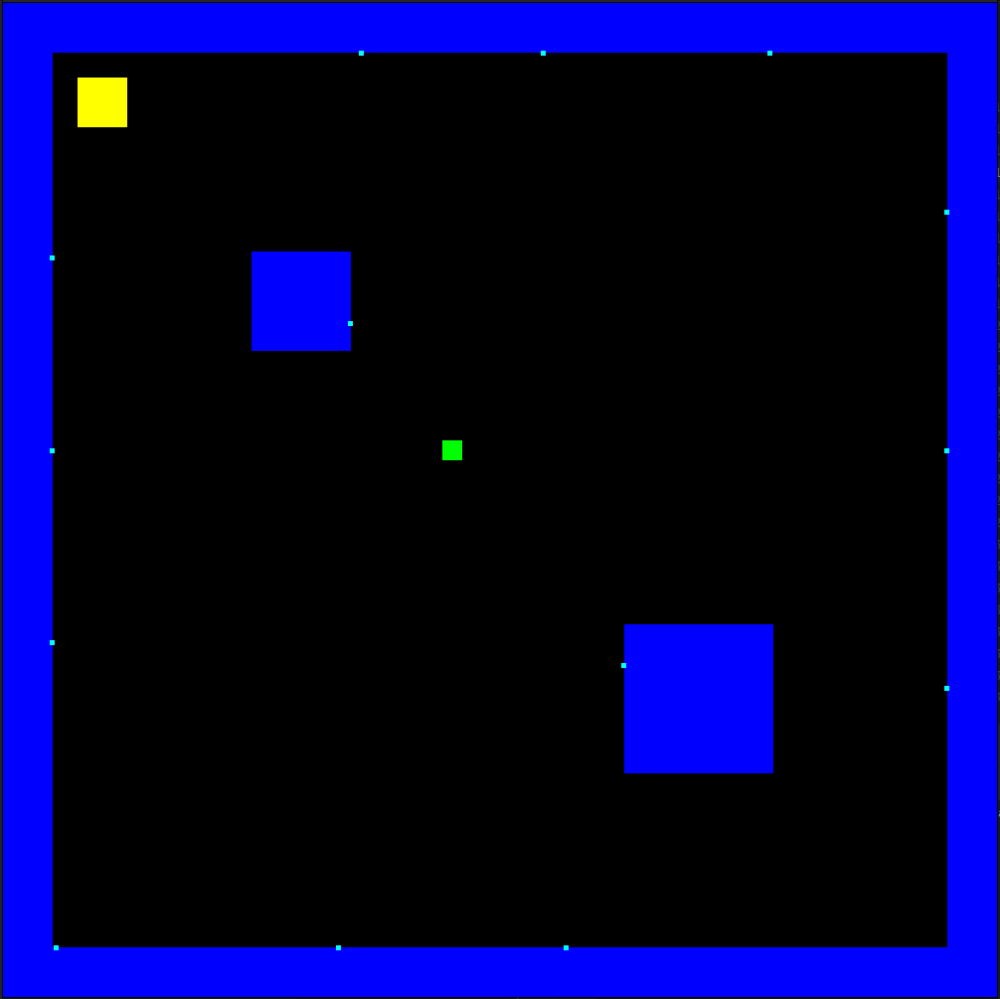
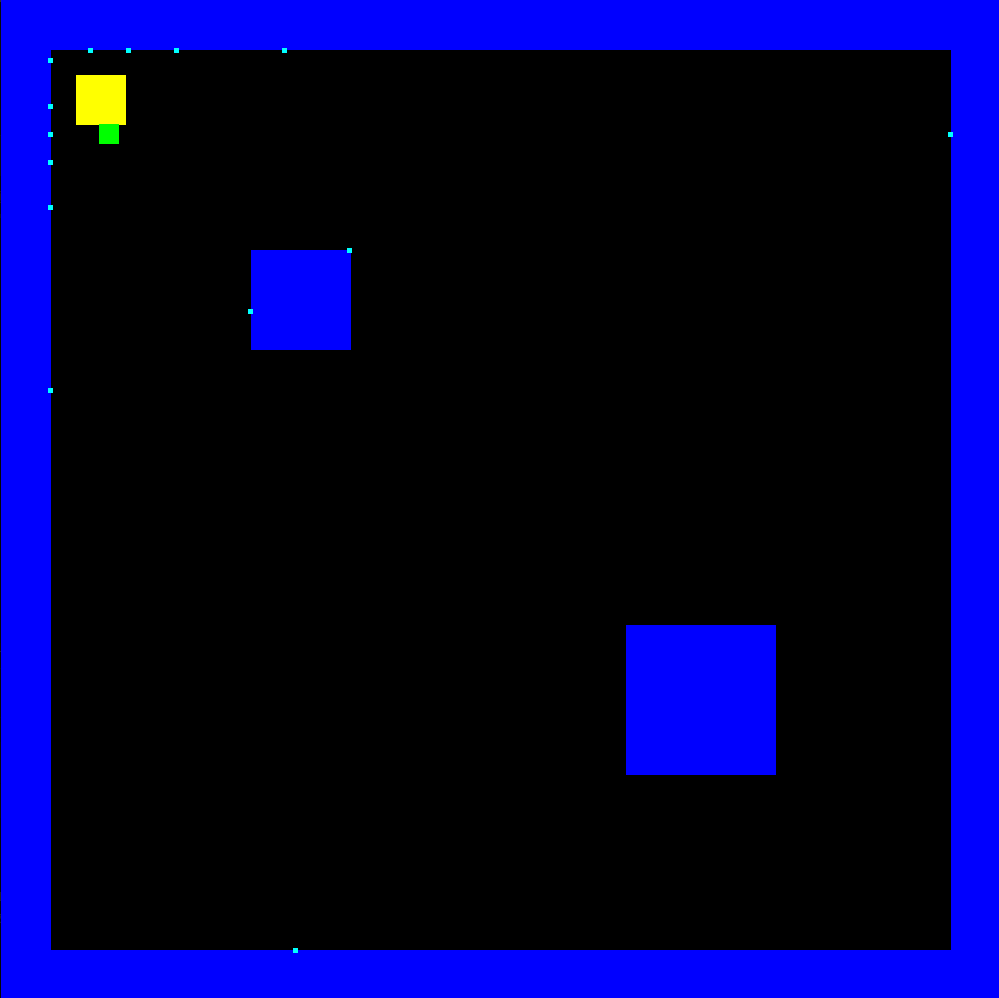

# RL-path-finding

## Описание проекта

RL-path-finding - это проект, реализующий алгоритм поиска пути с использованием обучения с подкреплением (Reinforcement Learning, RL). В основе проекта лежит алгоритм TD3 (Twin Delayed Deep Deterministic Policy Gradient), который является современным методом для задач непрерывного управления.

## Алгоритм TD3

TD3 (Twin Delayed Deep Deterministic Policy Gradient) - это алгоритм обучения с подкреплением, который улучшает оригинальный DDPG (Deep Deterministic Policy Gradient). Основные особенности TD3:

1. **Двойные Q-сети (Twin)**: Используются две отдельные Q-сети для уменьшения переоценки значений.
2. **Задержка обновления политики (Delayed)**: Политика обновляется реже, чем Q-функции, для стабильности.
3. **Добавление шума в целевое действие (Target Policy Smoothing)**: Регуляризация, предотвращающая переобучение.

TD3 особенно эффективен в задачах с непрерывным пространством действий, таких как управление роботами или, как в нашем случае, поиск пути.

## Установка зависимостей

Перед использованием проекта необходимо установить следующие зависимости:

### 1. Установка LibTorch

LibTorch - это C++ версия PyTorch, необходимая для работы нейронных сетей.

1. Перейдите на страницу загрузки PyTorch: https://pytorch.org/get-started/locally/#libtorch
2. Выберите версию LibTorch (рекомендуется последняя стабильная).
3. Для Linux выберите вариант "C++/Java" и загрузите версию для вашей системы (обычно Pre-cxx11 ABI).
4. Распакуйте архив в удобное место, например:
   ```bash
   unzip libtorch-cxx11-abi-shared-with-deps-2.1.0.zip -d ~/libs/
   ```

### 2. Установка SFML 3.0.0

SFML (Simple and Fast Multimedia Library) используется для визуализации.

1. Перейдите на страницу загрузки SFML: https://www.sfml-dev.org/download/sfml/3.0.0/
2. Скачайте версию для вашего дистрибутива Linux.
3. Установите зависимости:
   ```bash
   sudo apt-get install libsfml-dev
   ```
4. Или соберите из исходников:
   ```bash
   wget https://www.sfml-dev.org/files/SFML-3.0.0-sources.zip
   unzip SFML-3.0.0-sources.zip
   cd SFML-3.0.0
   cmake . && make && sudo make install
   ```

## Сборка проекта

1. Клонируйте репозиторий:
   ```bash
   git clone <адрес репозитория>
   cd RL-path-finding
   ```

2. Создайте директорию для сборки:
   ```bash
   mkdir build && cd build
   ```

3. Запустите CMake, указав пути к LibTorch и SFML:
   ```bash
   cmake -DCMAKE_PREFIX_PATH=~/libs/libtorch -DSFML_DIR=/path/to/sfml ..
   ```

4. Соберите проект:
   ```bash
   make
   ```

## Использование

После успешной сборки запустите программу:
```bash
./RL-path-finding
```

Программа предоставит интерфейс для:
- Обучения модели TD3
- Тестирования обученной модели
- Визуализации процесса поиска пути

## Структура проекта

```
RL-path-finding/
├── config/                 # Конфигурационные файлы
│   └── Config.h
├── include/                # Заголовочные файлы
│   ├── environment/
│   │   ├── Env.hpp
│   │   └── Renderer.hpp
│   └── ml/
│       └── RL.hpp
├── libtorch/           # LibTorch
├── SFML-3.0.0/         # SFML
├── src/                    # Исходный код
│   ├── common/             # Общие компоненты
│   │   ├── Consts.hpp
│   │   ├── Enums.hpp
│   │   └── Types.hpp
│   ├── environment/        # Логика окружения
│   │   ├── CMakeLists.txt
│   │   ├── Env.cpp
│   │   └── Renderer.cpp
│   ├── ml/                 # Реализация RL
│   │   ├── CMakeLists.txt
│   │   └── RL.cpp
│   ├── main.cpp            # Точка входа
│   └── CMakeLists.txt      # Основной CMake файл
├── images/                 # Изображения и видео
│   ├── training.png        # Пример обучения
│   ├── path_finding.gif    # Анимация поиска пути
│   └── results.mp4         # Видео с результатами
└── README.md               # Этот файл
```

## Примеры работы

### Обучение агента



### Видео с результатами
[Видео с результатами](images/video.mp4)

## Настройка параметров

Параметры обучения и окружения можно настроить в файле `config/Config.h`:
```cpp
// Параметры обучения
const int EPISODES = 10000;
const int MAX_STEPS = 500;
const int BATCH_SIZE = 512;
const int LOG_INTERVAL = 50;
const float ACTOR_LR = 3e-5;
const float CRITIC_LR = 3e-5;
const float GAMMA = 0.99f;          // Коэффициент дисконтирования
const float TAU = 0.005f;           // Для мягкого обновления целевых сетей
const int TRAIN_START_SIZE = 5000;
const int TRAIN_INTERVAL = 1;
```
